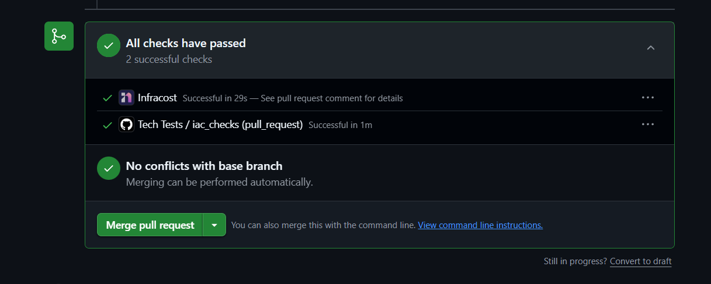
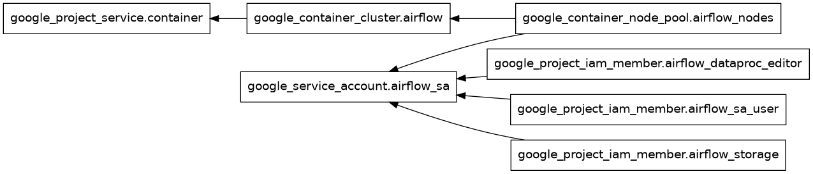
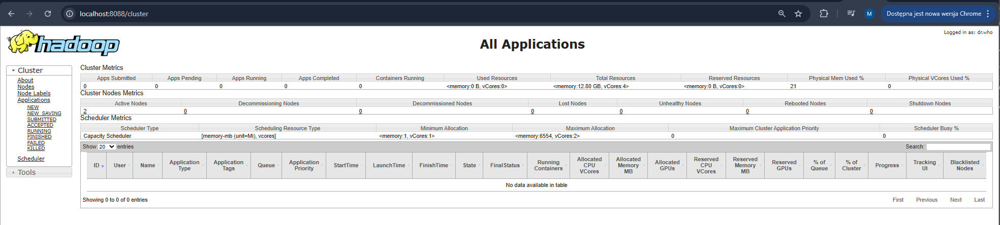
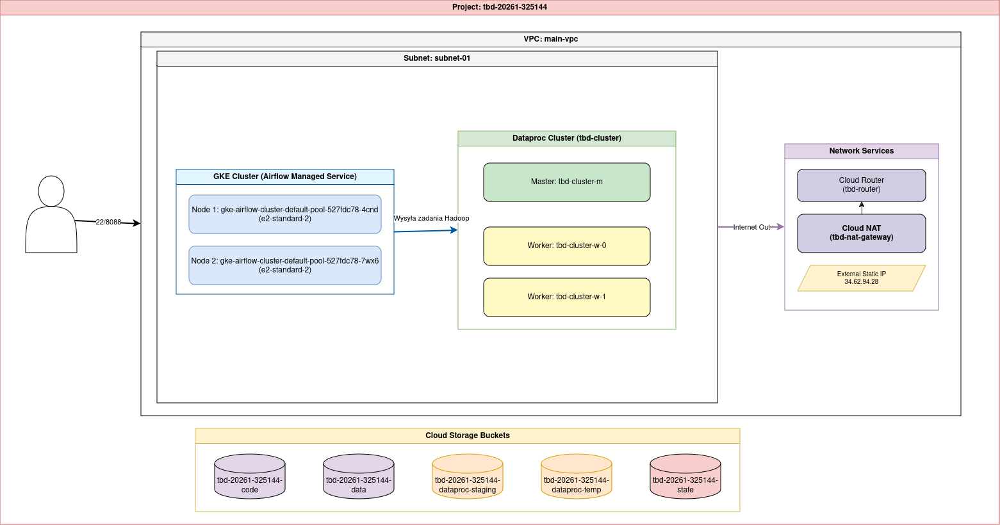
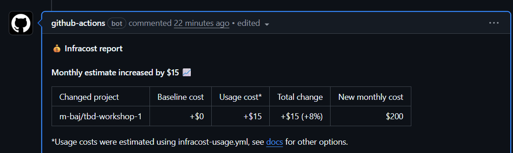
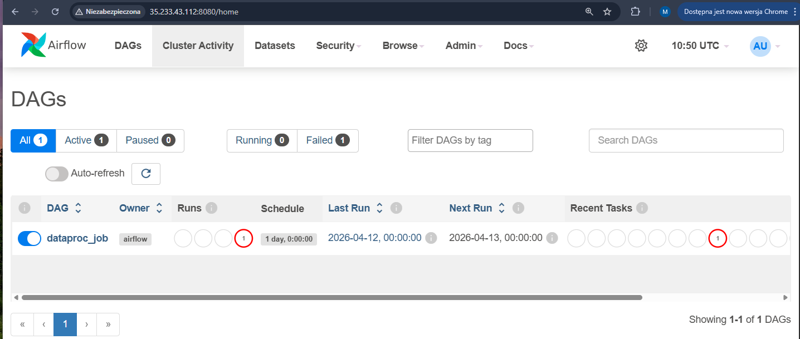
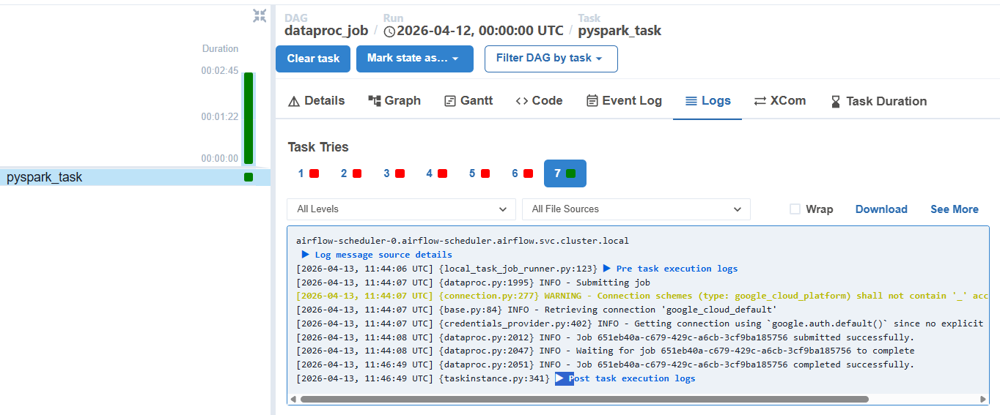
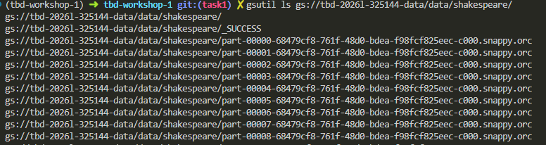

IMPORTANT ❗ ❗ ❗ Please remember to destroy all the resources after each work session. You can recreate infrastructure by creating new PR and merging it to master.


                                                                                                                                                                                                                                                                                                                                                                                  
## Phase 1 Exercise Overview

  ```mermaid
  flowchart TD
      A[🔧 Step 0: Fork repository] --> B[🔧 Step 1: Environment variables\nexport TF_VAR_*]
      B --> C[🔧 Step 2: Bootstrap\nterraform init/apply\n→ GCP project + state bucket]
      C --> D[🔧 Step 3: Quota increase\nCPUS_ALL_REGIONS ≥ 24]
      D --> E[🔧 Step 4: CI/CD Bootstrap\nWorkload Identity Federation\n→ keyless auth GH→GCP]
      E --> F[🔧 Step 5: GitHub Secrets\nGCP_WORKLOAD_IDENTITY_*\nINFRACOST_API_KEY]
      F --> G[🔧 Step 6: pre-commit install]
      G --> H[🔧 Step 7: Push + PR + Merge\n→ release workflow\n→ terraform apply]

      H --> I{Infrastructure\nrunning on GCP}

      I --> J[📋 Task 3: Destroy\nGitHub Actions → workflow_dispatch]
      I --> K[📋 Task 4: New branch\nModify tasks-phase1.md\nPR → merge → new release]
      I --> L[📋 Task 5: Analyze Terraform\nterraform plan/graph\nDescribe selected module]
      I --> M[📋 Task 6: YARN UI\ngcloud compute ssh\nIAP tunnel → port 8088]
      I --> N[📋 Task 7: Architecture diagram\nService accounts + buckets]
      I --> O[📋 Task 8: Infracost\nUsage profiles for\nartifact_registry + storage_bucket]
      I --> P[📋 Task 9: Spark job fix\nAirflow UI → DAG → debug\nFix spark-job.py]
      I --> Q[📋 Task 10: BigQuery\nDataset + external table\non ORC files]
      I --> R[📋 Task 11: Spot instances\npreemptible_worker_config\nin Dataproc module]
      I --> S[📋 Task 12: Auto-destroy\nNew GH Actions workflow\nschedule + cleanup tag]

      style A fill:#4a9eff,color:#fff
      style B fill:#4a9eff,color:#fff
      style C fill:#4a9eff,color:#fff
      style D fill:#ff9f43,color:#fff
      style E fill:#4a9eff,color:#fff
      style F fill:#ff9f43,color:#fff
      style G fill:#4a9eff,color:#fff
      style H fill:#4a9eff,color:#fff
      style I fill:#2ed573,color:#fff
      style J fill:#a55eea,color:#fff
      style K fill:#a55eea,color:#fff
      style L fill:#a55eea,color:#fff
      style M fill:#a55eea,color:#fff
      style N fill:#a55eea,color:#fff
      style O fill:#a55eea,color:#fff
      style P fill:#a55eea,color:#fff
      style Q fill:#a55eea,color:#fff
      style R fill:#a55eea,color:#fff
      style S fill:#a55eea,color:#fff
```

  Legend

  - 🔵 Blue — setup steps (one-time configuration)
  - 🟠 Orange — manual steps (GCP Console / GitHub UI)
  - 🟢 Green — infrastructure ready
  - 🟣 Purple — tasks to complete and document in tasks-phase1.md

1. Authors:

   - **group nr 3**

   - **[https://github.com/m-baj/tbd-workshop-1](https://github.com/m-baj/tbd-workshop-1)**

2. Follow all steps in README.md.

3. From available Github Actions select and run destroy on master branch.

4. Create new git branch and:
    1. Modify tasks-phase1.md file.

    2. Create PR from this branch to **YOUR** master and merge it to make new release.

    


5. Analyze terraform code. Play with terraform plan, terraform graph to investigate different modules.


### Module Description: `modules/airflow`

The **Airflow** module is responsible for deploying a robust data orchestration platform based on **Google Kubernetes Engine (GKE)**. It serves as the "control center" for the entire Big Data ecosystem, managing the scheduling and execution of data pipelines.

**Key features of the module:**

* **Identity & Access Management (IAM):** The module creates a dedicated Service Account (`airflow_sa`) with least-privilege permissions, ensuring that the Kubernetes nodes only have the access necessary to interact with other GCP services.
* **Infrastructure Scalability:** It defines both the GKE Control Plane and a separate Node Pool (`airflow_nodes`). This separation allows for granular control over machine types (e.g., CPU/RAM optimized) used for executing Spark jobs or Airflow DAGs.
* **Security Hardening:** By implementing **Workload Identity**, **Shielded Nodes**, and **Binary Authorization**, the module ensures that only trusted containers are executed and that sensitive credentials are never stored as static JSON keys within the cluster.
* **Network Integration:** The cluster is tightly integrated into the project's VPC, allowing for secure internal communication between Airflow workers and other components like Dataproc or Cloud Storage.

---

6. Reach YARN UI

```bash
gcloud compute ssh tbd-cluster-m \
    --project=tbd-2026l-325144 \
    --zone=europe-west1-b \
    --tunnel-through-iap \
    -- -L 8088:localhost:8088
```
- port: 8088



   Hint: the Dataproc cluster has `internal_ip_only = true`, so you need to use an IAP tunnel.
   See: `gcloud compute ssh` with `-- -L <local_port>:localhost:<remote_port>` and `--tunnel-through-iap` flag.
   YARN ResourceManager UI runs on port **8088**.

7. Draw an architecture diagram (e.g. in draw.io) that includes:
    1. Description of the components of service accounts
    2. List of buckets for disposal

    

8. Create a new PR and add costs by entering the expected consumption into Infracost
For all the resources of type: `google_artifact_registry_repository`, `google_storage_bucket`
create a sample usage profiles and add it to the Infracost task in CI/CD pipeline. Usage file [example](https://github.com/infracost/infracost/blob/master/infracost-usage-example.yml)

   ```yaml
   version: 0.1
    resource_usage:
    module.dataproc.google_storage_bucket.dataproc_staging:
        storage_gb: 50
        monthly_class_a_operations: 5000
        monthly_class_b_operations: 20000

    module.dataproc.google_storage_bucket.dataproc_temp:
        storage_gb: 100
        monthly_class_a_operations: 2000
        monthly_class_b_operations: 10000

    module.data-pipelines.google_storage_bucket.tbd-code-bucket:
        storage_gb: 1
        monthly_class_a_operations: 100
        monthly_class_b_operations: 500

    module.data-pipelines.google_storage_bucket.tbd-data-bucket:
        storage_gb: 500
        monthly_class_a_operations: 10000
        monthly_class_b_operations: 100000

    module.gcr.google_artifact_registry_repository.registry:
        storage_gb: 20
   ```

   

9. Find and correct the error in spark-job.py

    After `terraform apply` completes, connect to the Airflow cluster:
    ```bash
    gcloud container clusters get-credentials airflow-cluster --zone europe-west1-b --project PROJECT_NAME
    ```
    
    Then check the external IP (AIRFLOW_EXTERNAL_IP) of the webserver service:
    kubectl get svc -n airflow airflow-webserver                                                                                                                                                                 
                                                                                                                                                                                                                                     
    ▎ Note: If EXTERNAL-IP shows <pending>, wait a moment and retry — LoadBalancer IP allocation may take 1-2 minutes.  

    DAG files are synced automatically from your GitHub repo via git-sync sidecar.
    Airflow variables and the `google_cloud_default` GCP connection are also configured by Terraform.

    a) In the Airflow UI (http://AIRFLOW_EXTERNAL_IP:8080, login: admin/admin), find the `dataproc_job` DAG, unpause it and trigger it manually.

    


    b) The DAG will fail. Examine the task logs in the Airflow UI to find the root cause.

    ```
    File "/home/airflow/.local/lib/python3.12/site-packages/google/api_core/grpc_helpers.py", line 78, in error_remapped_callable
    raise exceptions.from_grpc_error(exc) from exc
    google.api_core.exceptions.PermissionDenied: 403 Permission 'dataproc.clusters.use' denied on resource '//dataproc.googleapis.com/projects/tbd-2026l-325144/regions/europe-west1/clusters/tbd-cluster' (or it may not exist). [reason: "IAM_PERMISSION_DENIED"
    domain: "dataproc.googleapis.com"
    metadata {
    key: "resource"
    value: "projects/tbd-2026l-325144/regions/europe-west1/clusters/tbd-cluster"
    }
    metadata {
    key: "permission"
    value: "dataproc.clusters.use"
    }
    ]
    [2026-04-13, 10:45:11 UTC] {taskinstance.py:1226} INFO - Marking task as FAILED. dag_id=dataproc_job, task_id=pyspark_task, run_id=scheduled__2026-04-12T00:00:00+00:00, execution_date=20260412T000000, start_date=20260413T104509, end_date=20260413T104511
    [2026-04-13, 10:45:11 UTC] {taskinstance.py:341} ▶ Post task execution logs
   ```

    ***describe what the error is and how you found it***

    c) Fix the error in `modules/data-pipeline/resources/spark-job.py` and re-upload the file to GCS:
    ```bash
    gsutil cp modules/data-pipeline/resources/spark-job.py gs://PROJECT_NAME-code/spark-job.py
    ```
    Then trigger the DAG again from the Airflow UI.

    link do pliku: [modules/data-pipeline/resources/spark-job.py](modules/data-pipeline/resources/spark-job.py)

    d) Verify the DAG completes successfully and check that ORC files were written to the data bucket:
    ```bash
    gsutil ls gs://PROJECT_NAME-data/data/shakespeare/
    ```

    
    

11. Create a BigQuery dataset and an external table using SQL

    Using the ORC data produced by the Spark job in task 9, create a BigQuery dataset and an external table.

    Note: the dataset must be created in the same region as the GCS bucket (`europe-west1`), e.g.:
    ```bash
    bq mk --dataset --location=europe-west1 shakespeare
    ```

    ```sql
    CREATE OR REPLACE EXTERNAL TABLE `526956755058.shakespeare.word_counts`
    OPTIONS (
        format = 'ORC',
        uris = ['gs://tbd-2026l-325144-data/data/shakespeare/*.orc']
    );
    ```

    ***why does ORC not require a table schema?***

    ORC (Optimized Row Columnar) nie wymaga ręcznego definiowania schematu tabeli, ponieważ jest formatem samopisującym się.

    Oznacza to, że plik ORC zawiera wewnątrz siebie nie tylko same dane, ale również pełne metadane dotyczące ich struktury. Informacje te są przechowywane w tzw. stopce pliku i obejmują:
     - nazwy wszystkich kolumn,
     - typy danych przypisane do tych kolumn (np. integer, string, boolean),
     - statystyki dotyczące danych (np. wartości min/max), co dodatkowo przyspiesza zapytania.

12. Add support for preemptible/spot instances in a Dataproc cluster

    - [modules/dataproc/main.tf](modules/dataproc/main.tf)
    
    ```json
     preemptible_worker_config {
      num_instances = 2
      disk_config {
        boot_disk_type    = "pd-standard"
        boot_disk_size_gb = 100
      }
    }
    ```


13. Triggered Terraform Destroy on Schedule or After PR Merge. Goal: make sure we never forget to clean up resources and burn money.

Add a new GitHub Actions workflow that:
  1. runs terraform destroy -auto-approve
  2. triggers automatically:

   a) on a fixed schedule (e.g. every day at 20:00 UTC)

   b) when a PR is merged to master containing [CLEANUP] tag in title

Steps:
  1. Create file .github/workflows/auto-destroy.yml
  2. Configure it to authenticate and destroy Terraform resources
  3. Test the trigger (schedule or cleanup-tagged PR)

Hint: use the existing `.github/workflows/destroy.yml` as a starting point.

***paste workflow YAML here***
```yaml
name: Auto-destroy Infrastructure

on:
  schedule:
    - cron: '0 20 * * *'
  pull_request:
    types: [closed]
    branches: [master]
  workflow_dispatch:

permissions: read-all

jobs:
  auto-destroy:
    if: |
      github.event_name == 'schedule' || 
      github.event_name == 'workflow_dispatch' ||
      (github.event.pull_request.merged == true && contains(github.event.pull_request.title, '[CLEANUP]'))
    
    runs-on: ubuntu-latest
    permissions:
      contents: write
      id-token: write
      pull-requests: write
      issues: write

    steps:
    - uses: 'actions/checkout@v3'
    
    - uses: hashicorp/setup-terraform@v2
      with:
        terraform_version: 1.11.0

    - id: 'auth'
      name: 'Authenticate to Google Cloud'
      uses: 'google-github-actions/auth@v1'
      with:
        token_format: 'access_token'
        workload_identity_provider: ${{ secrets.GCP_WORKLOAD_IDENTITY_PROVIDER_NAME }}
        service_account: ${{ secrets.GCP_WORKLOAD_IDENTITY_SA_EMAIL }}

    - name: Terraform Init
      id: init
      run: terraform init -backend-config=env/backend.tfvars

    - name: Terraform Destroy
      id: destroy
      run: terraform destroy -no-color -var-file env/project.tfvars -auto-approve
```

***paste screenshot/log snippet confirming the auto-destroy ran***


***write one sentence why scheduling cleanup helps in this workshop***

Harmonogram zapobiega niekontrolowanemu naliczaniu opłat za zasoby, o których można zapomnieć po zakończeniu sesji pracy i łątwo wyczerpać budżet warsztatowy.
